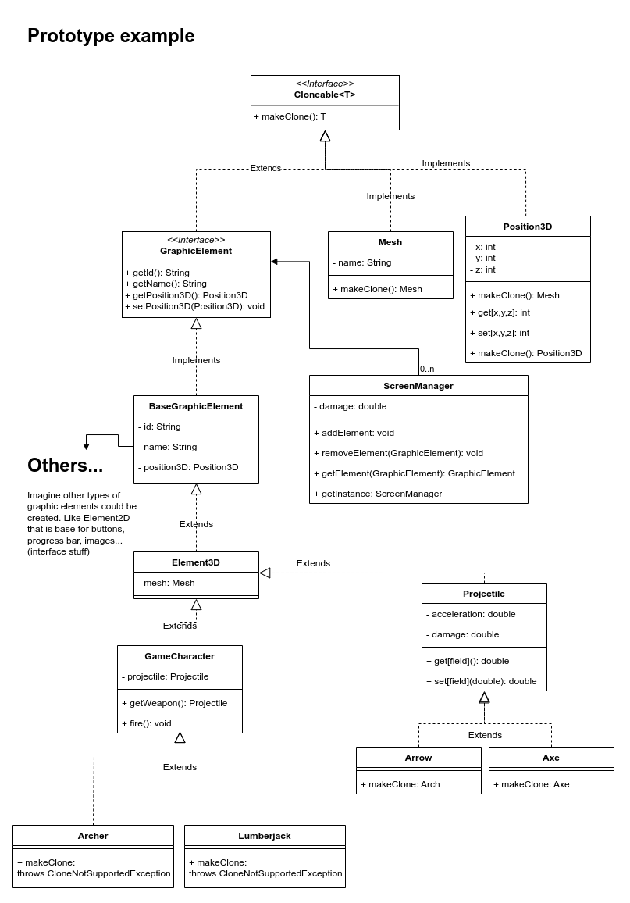

## Prototype

**Goal**: copy objects without making the client dependent on the objects' classes.

When the client code requires a copy of a object but it doesn't know its class,
the Cloneable interface may provide a copy() method to make sure the proper copy
will be created.

### Example

For a game engine, a screenManager receives a GraphicElement to be rendered. A 
base class (BaseGraphElement) is created implementing GraphicElement (which extends Cloneable).
That way all GraphicElement could be cloned, if not, throws CloneNotSupportedException.

Considering tha a playable character (Archer/Lumberjack) may shoot using a projectile (Arch/Axe),
each new projectile is just a copy of itself being thrown starting at the character
position. The business logic says that two of the same character cannot be on the screen at 
the same time, so it's impossible to clone it.

