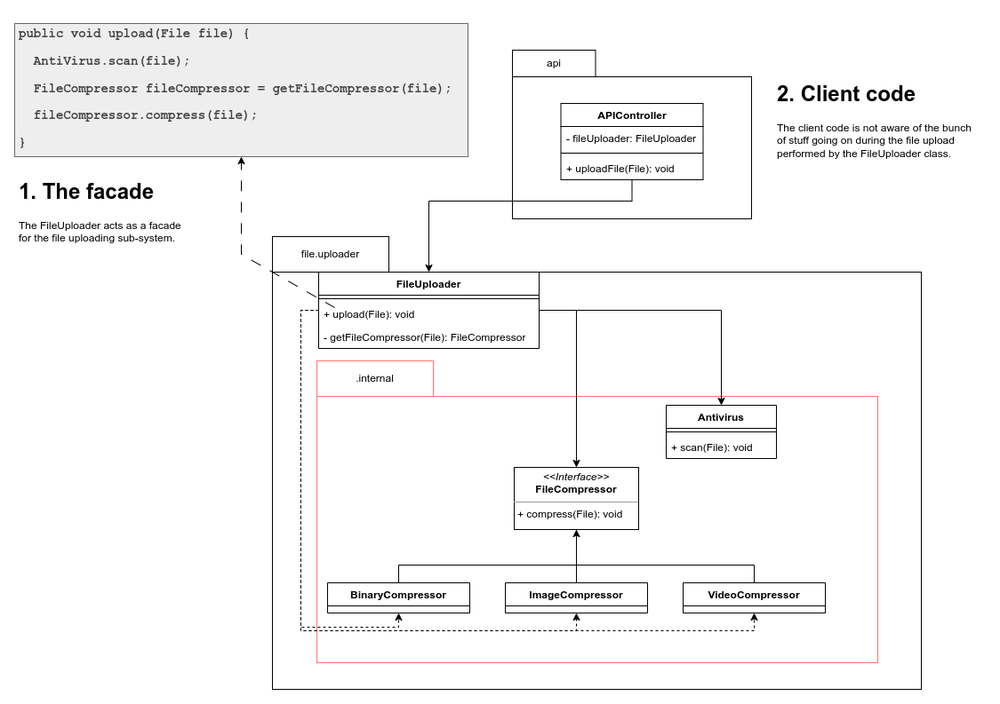

## Facade

### Goal

Provide a simple way of interacting with a complex system. 

### Motivation

Systems grow, and so their complexity. If not written well, the client will 
be depending on a bunch of internal classes that have no purpose for them. 
For instance, why should the frontend care about the credit card and login validation 
instead of just receiving the Ok (200 code) and the redirect link.

#### Notes:

- A facade may call another facade, meaning the system have multiple sub-systems.

##### References

1. Design Patterns, GOF
2. https://refactoring.guru/design-patterns/facade

### My example
Uploading a file generally involves virus scanning, compression and 
other stuff. By not making the client (e.g., the API controller which calls the
service that handles the upload).

